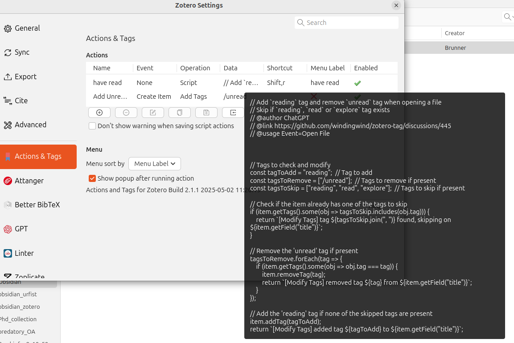
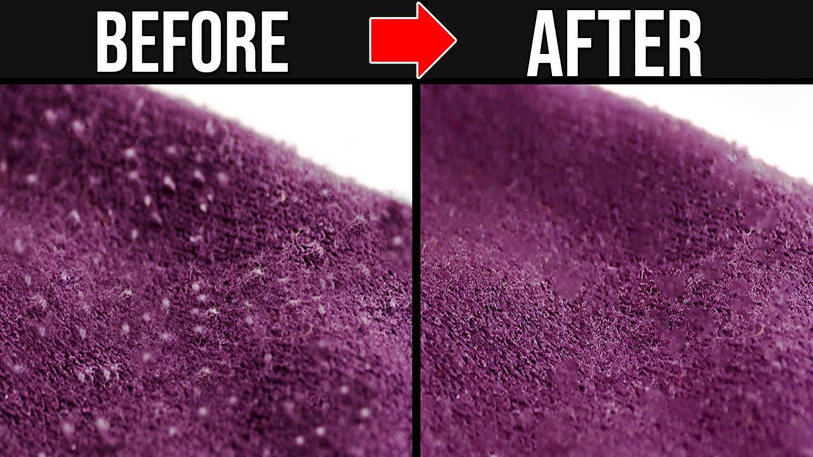
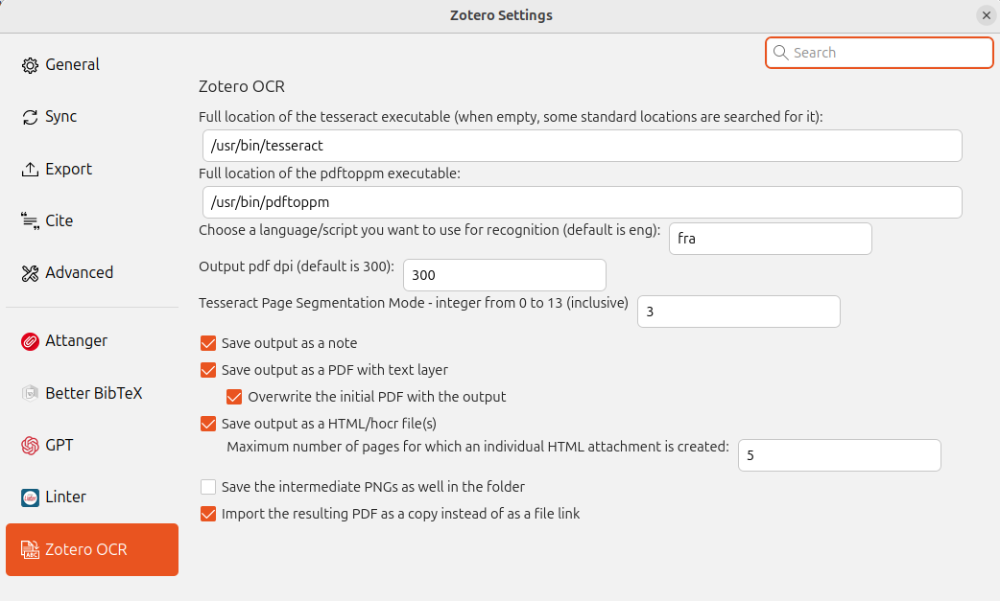
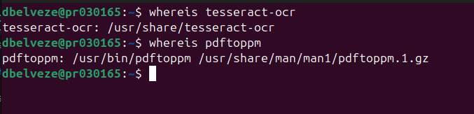

<!--

title: "Learning more with Zotero"  

author: Damien Belvèze

date: may 2025

email: damien.belveze@univ-rennes.fr 

attribute: [First steps with Zotero](https://liascript.github.io/course/?https://raw.githubusercontent.com/damienbelveze/CFCB_IA/main/deroule_cours.md#1) 
        by [Damien Belvèze](damien.belveze@univ-rennes.fr) 
        is licensed under [CC-by-sa](https://creativecommons.org/licenses/by-sa/4.0/?ref=chooser-v1)

language: fr 

link: lia.css

icon: ./images/etoile.png

comment: this guide is adapted to PhD students who want to improve and deepen their use  reference manager Zotero. Much of its content comes from the Zotero workshop libguide published by Formadoct and archived on [Internet Archive](https://web.archive.org/web/20210622005132/https://formadoct.doctorat-bretagneloire.fr/zotero_workshop/introduction)

import: https://raw.githubusercontent.com/LiaTemplates/citations/main/README.md

@onload
// this shall load an entire file at starttime that can be referenced
setTimeout(() => { window.bibliographyLoad("https://raw.githubusercontent.com/LiaTemplates/citations/main/bibtex.bib")}, 100)
@end

-->

# Learning more with Zotero

```ascii 


          _____                   _____               _____                   _____                   _____                   _____                   _____                   _____          
         /\    \                 /\    \             /\    \                 /\    \                 /\    \                 /\    \                 /\    \                 /\    \         
        /::\    \               /::\    \           /::\____\               /::\    \               /::\____\               /::\    \               /::\    \               /::\    \        
       /::::\    \             /::::\    \         /:::/    /              /::::\    \             /::::|   |              /::::\    \             /::::\    \             /::::\    \       
      /::::::\    \           /::::::\    \       /:::/    /              /::::::\    \           /:::::|   |             /::::::\    \           /::::::\    \           /::::::\    \      
     /:::/\:::\    \         /:::/\:::\    \     /:::/    /              /:::/\:::\    \         /::::::|   |            /:::/\:::\    \         /:::/\:::\    \         /:::/\:::\    \     
    /:::/__\:::\    \       /:::/  \:::\    \   /:::/____/              /:::/__\:::\    \       /:::/|::|   |           /:::/  \:::\    \       /:::/__\:::\    \       /:::/  \:::\    \    
   /::::\   \:::\    \     /:::/    \:::\    \  |::|    |              /::::\   \:::\    \     /:::/ |::|   |          /:::/    \:::\    \     /::::\   \:::\    \     /:::/    \:::\    \   
  /::::::\   \:::\    \   /:::/    / \:::\    \ |::|    |     _____   /::::::\   \:::\    \   /:::/  |::|   | _____   /:::/    / \:::\    \   /::::::\   \:::\    \   /:::/    / \:::\    \  
 /:::/\:::\   \:::\    \ /:::/    /   \:::\ ___\|::|    |    /\    \ /:::/\:::\   \:::\    \ /:::/   |::|   |/\    \ /:::/    /   \:::\    \ /:::/\:::\   \:::\    \ /:::/    /   \:::\ ___\ 
/:::/  \:::\   \:::\____/:::/____/     \:::|    |::|    |   /::\____/:::/  \:::\   \:::\____/:: /    |::|   /::\____/:::/____/     \:::\____/:::/__\:::\   \:::\____/:::/____/     \:::|    |
\::/    \:::\  /:::/    \:::\    \     /:::|____|::|    |  /:::/    \::/    \:::\  /:::/    \::/    /|::|  /:::/    \:::\    \      \::/    \:::\   \:::\   \::/    \:::\    \     /:::|____|
 \/____/ \:::\/:::/    / \:::\    \   /:::/    /|::|    | /:::/    / \/____/ \:::\/:::/    / \/____/ |::| /:::/    / \:::\    \      \/____/ \:::\   \:::\   \/____/ \:::\    \   /:::/    / 
          \::::::/    /   \:::\    \ /:::/    / |::|____|/:::/    /           \::::::/    /          |::|/:::/    /   \:::\    \              \:::\   \:::\    \      \:::\    \ /:::/    /  
           \::::/    /     \:::\    /:::/    /  |:::::::::::/    /             \::::/    /           |::::::/    /     \:::\    \              \:::\   \:::\____\      \:::\    /:::/    /   
           /:::/    /       \:::\  /:::/    /   \::::::::::/____/              /:::/    /            |:::::/    /       \:::\    \              \:::\   \::/    /       \:::\  /:::/    /    
          /:::/    /         \:::\/:::/    /     ~~~~~~~~~~                   /:::/    /             |::::/    /         \:::\    \              \:::\   \/____/         \:::\/:::/    /     
         /:::/    /           \::::::/    /                                  /:::/    /              /:::/    /           \:::\    \              \:::\    \              \::::::/    /      
        /:::/    /             \::::/    /                                  /:::/    /              /:::/    /             \:::\____\              \:::\____\              \::::/    /       
        \::/    /               \::/____/                                   \::/    /               \::/    /               \::/    /               \::/    /               \::/____/        
         \_____/                 _______          _____                   _________/              _________/             __________/                 \/____/                 ~~              
         /\    \                /::\    \        /\    \                 /\    \                 /\    \                /::\    \                                                            
        /::\    \              /::::\    \      /::\    \               /::\    \               /::\    \              /::::\    \                                                           
        \:::\    \            /::::::\    \     \:::\    \             /::::\    \             /::::\    \            /::::::\    \                                                          
         \:::\    \          /::::::::\    \     \:::\    \           /::::::\    \           /::::::\    \          /::::::::\    \                                                         
          \:::\    \        /:::/~~\:::\    \     \:::\    \         /:::/\:::\    \         /:::/\:::\    \        /:::/~~\:::\    \                                                        
           \:::\    \      /:::/    \:::\    \     \:::\    \       /:::/__\:::\    \       /:::/__\:::\    \      /:::/    \:::\    \                                                       
            \:::\    \    /:::/    / \:::\    \    /::::\    \     /::::\   \:::\    \     /::::\   \:::\    \    /:::/    / \:::\    \                                                      
             \:::\    \  /:::/____/   \:::\____\  /::::::\    \   /::::::\   \:::\    \   /::::::\   \:::\    \  /:::/____/   \:::\____\                                                     
              \:::\    \|:::|    |     |:::|    |/:::/\:::\    \ /:::/\:::\   \:::\    \ /:::/\:::\   \:::\____\|:::|    |     |:::|    |                                                    
_______________\:::\____|:::|____|     |:::|    /:::/  \:::\____/:::/__\:::\   \:::\____/:::/  \:::\   \:::|    |:::|____|     |:::|    |                                                    
\::::::::::::::::::/    /\:::\    \   /:::/    /:::/    \::/    \:::\   \:::\   \::/    \::/   |::::\  /:::|____|\:::\    \   /:::/    /                                                     
 \::::::::::::::::/____/  \:::\    \ /:::/    /:::/    / \/____/ \:::\   \:::\   \/____/ \/____|:::::\/:::/    /  \:::\    \ /:::/    /                                                      
  \:::\~~~~\~~~~~~         \:::\    /:::/    /:::/    /           \:::\   \:::\    \           |:::::::::/    /    \:::\    /:::/    /                                                       
   \:::\    \               \:::\__/:::/    /:::/    /             \:::\   \:::\____\          |::|\::::/    /      \:::\__/:::/    /                                                        
    \:::\    \               \::::::::/    /\::/    /               \:::\   \::/    /          |::| \::/____/        \::::::::/    /                                                         
     \:::\    \               \::::::/    /  \/____/                 \:::\   \/____/           |::|  ~|               \::::::/    /                                                          
      \:::\    \               \::::/    /                            \:::\    \               |::|   |                \::::/    /                                                           
       \:::\____\               \::/____/                              \:::\____\              \::|   |                 \::/____/                                                            
        \::/    /                ~~                                     \::/    /               \:|   |                  ~~                                                                  
         \/____/                                                         \/____/                 \|___|                                                                                      
                                                                                                                                                                                             


```

For basic use of Zotero see [First steps with Zotero](https://liascript.github.io/course/?https://raw.githubusercontent.com/damienbelveze/first_steps_zotero/main/first_steps_zotero.md#1)

Throughout this lesson, activities and demos will be led from the Zotero collection <a href="advanced_zotero.bib" download>"advanced Zotero"</a> that might download and import in your own Zotero library.

# 1. How to deal with the storage limitation of Zotero cloud

Each free account is limited to 300 MB storage on Zotero servers. The payment of extra-storage makes it possible for Zotero developers to provide the software itself free (like in "free beer") for all, but it's still a limit that can be bypassed. 
In 6th version, you might have used the Zotfile plugin to save your references and PDFs in a third-party server (Dropbox, OneDrive, Nextcloud). Zotfile has not been rewritten for the 7th version, but you may replace it with the Attanger plugin. 

However hosting group libraries remains a problem, since the storage group remains attached to the space dedicated to his/her creator. 
If they run out of space, moving references and PDFs to a third-party server won't be an alternative, because other members won't be able to access the underlying sqlite database which remains local on the group's manager computer. 

There are paying alternatives (Zotero monetizes hosting plans (unlimited storage for university's users and groups) with universities), but as a library we need to make choices, and we coud not afford so far to pay for such an agreement.

## 1.1 How to load a plugin in Zotero

anytime we need to add a plugin into Zotero, we follow the same process:

- Download the latest release (.xpi file) from:  
        * Latest Stable  
        * All Releases  
- Note: If you're using Firefox as your browser, right click the xpi and select "Save As.."  
- In Zotero click "Tools" in the top menu bar and then click "Addons"  
- Go to the Extensions page and then click the gear icon in the top right.  
- Select Install Add-on from file.  
- Browse to where you downloaded the .xpi file and select it.  
- Restart Zotero, by clicking "restart now" in the extensions list where the plugin is now listed.  

## 1.2 Let's install our (maybe) first plugin in Zotero


load the [attanger plugin](https://github.com/MuiseDestiny/zotero-attanger) into Zotero extension manager. 
If needed, restart Zotero. 
Send a copy to a third party (OneDrive, Nextcloud, etc.) rather than to 300MB limited storage on Zotero servers. 

Edit > Settings > attanger

- Source path : keep current source path (usr/Zotero/storage)
- Attach type : link 
- Destination path : path to the third-party location storage 


# 2. How to automatically add tags linked to specific actions 


load the [Action & Tag plugin](https://video.univ-rennes1.fr/permalink/v1268af4fca2dp7avzaf/iframe/)

load the [attanger plugin](https://github.com/MuiseDestiny/zotero-attanger) into Zotero extension manager. 
If needed, restart Zotero. 

Edit > Settings > Actions & Tags



In this example, we set two rules : 

- the first one automaticaly adds a "/unread" tag when an item is created in the Zotero library
- the second one is triggered by a shortcut (Shift+R) and execute for the selected item(s) a script that removes the "/unread" tag and replaces it by a "reading" tag
This script was founded here  

**exercise : how to add the emoji "note" (🗒️) whenever a note is appended to an item ?**

# 3. how to polish your references with Java Scripts and Linter plugin

*To lint* is commonly used for clothes and means "to use a gadget for getting rid of fibres"



applied to references, this means reduce the heterogeneity of values collected in the various fields of a set of references.
This will make easier to process bibliographic data in third-party software, like visualization tools. 

These tasks may be achieved through the Linter plugin or through adhoc scripts shared by the community of users.

we will browser both types of resources.


## 3.1 Linter


Linter was designed to apply slight formal corrections to Libraty items

- Title case -> Sentence Case 
- normal case -> capitalized, bold, italics, sub/superscripts  
- whatever date format -> ISO 8601 (YYYY-MM-DDT)  
- put the language in the right form (*en* instead of "english", "English", eng, Eng, etc.)
- remove https://doi.org/ before the DOI in the DOI field

If you want to visualize your references in a timeline, you will need to manage uniform date format. 
The most used is ISO 8601 


| function | default shortcut | HTML equivalent | activity |
|:---|:---|:---|:---|
| Supscript | Ctrl + Shift + + | \<sup>word\<sup> |supscript tm in LegoTM [in this reference's title](http://www.cccg.umontreal.ca/pdf/social%20investment%20jane%20jenson.pdf) |
| Subscript | Ctrl + = | \<sub>word\</sub> | Subscript 2 in [this reference's title](10.3357/asem.2481.2009) |
| Bold: Ctrl + B | \<b>word\</b> |     |
| Italic | Ctrl + I | \<i>word\</i> | in the [following reference's title](https://pmc.ncbi.nlm.nih.gov/articles/PMC3518271/) put Salvia Hispanica in italics |
| No case | Ctrl + N | Setting class="nocase" | decapitalize Bell Hooks in the [title of this reference](https://youtu.be/u60jNSV1NSk?feature=shared) |

```txt
you can try this on the references contained in <a href="advanced_zotero.bib" download>our zotero collection</a> : 

- Import the bib file into your Zotero library
- apply to each reference the action recorded in its child note
```


## 3.2 Run scripts through Zotero to execute bulk actions 

Add / remove / replace tags with Thalient-ai Java scripts 

1. Select items in a collection (or open a collection to run the script on all the items it contains)
2. Tools > developers > copy and paste the [script that can be found on Thalient-ai github repository](https://github.com/thalient-ai/zotero-scripts/blob/main/zotero-batch-tag/src/zotero_batch_tag.js)
3. Run the code 
4. Follow the instructions


# 4. How to use Optical Character Recognition within Zotero dashboard

In digital humanities, it can be usefull to make to things at the same time : 

- manage references with attached PDF which are scan outputs
- making these PDF searchable within Zotero (which is not possible if the documents were scanned as images which is more often the case)

We can solve the problem within Zotero if we are able to : 
- install an OCR tool on our computer 
- use it within Zotero to ocerize PDF files from scans 

## 4.1 What can you do with this plugin

By Ocerization, we mean the **operation of using Optical Character Recognition** to index and make searchable the content of a PDF which was previously scanned as an image formated as a PDF 
Thanks to Zotero-ocr plugin (adapted to Zotero 7), it's possible to ocerize PDF provided they have a parent item. 
This plugin is usefull for researchers who need to work on photographs of printed material. 

## 4.2 How does it work

This plugin needs some packages to be installed in order to be run through Zotero. 
The needed packages are **Tesseract-ocr** and **Poppler-Utils** 

Installation on GNU/Linux systems: 

```shell
sudo apt install tesseract-ocr
sudo apt install libtesseract-dev
# installs tesseract-ocr
# for other OS see here : https://tesseract-ocr.github.io/tessdoc/Installation.html
sudo apt-get -y install poppler-utils
# installs poppler-utils 
```

Now you should install zotero_ocr add-on from file the way we have already shown
The .xpi file of the last release [can be downloaded from there](https://github.com/UB-Mannheim/zotero-ocr/releases/tag/0.8.1)

Once you have installed this plugin, you will be able to open its settings (edit > settings > zotero-ocr)

Zotero-ocr settings</img>

By default, the paths to tesseract & pdftoppm (a package of poppler-utils) are empty. 
If you leave these fields empty, it may work, but if it does not work, you will have to provide the paths to these utilities. 

In order to locate these packages, you may use the ```$ whereis <package>``` command for GNU/Linux systems (homolog to ```$ where <package>``` command for Windows):

command lines to locate tesseract-ocr and pdftoppm packages</img>

fill the empty fields with these paths. 

Go to your library and create two manuscripts (zotero-ocr and zotero-ocr-fr)
Attach to the first one  <a href="zotero_ocr/pdf_ocr.pdf" download>the following text</a>, and to the second one (zotero-ocr-fr) <a href="zotero_ocr/ocr_french.pdf" download>this document written in French</a> (the first one was written in English).

Open pdf_ocr.pdf (attached to the first manuscript item) in Zotero's viewer ; you may notice that the text within this document is not searchable. 
Now right-click on this PDF in your collection and select "OCR selected Pdf(s)"
After a few seconds (if there is only one page it will be quite immediate), Tesseract will ocerize this text. 
Now depending on the plugin settings, you may have different outputs

The indexed output may be stored as an item note if you left the option *save output as note* checked
or it may come as a second PDF (which content will be then searchable in contrast with the former one) if you have not kept the option "overwrite the initial pdf with the output" checked.
other files may have been added such as html files filled with the text contained by each PDF page (these files can be located in your storage library), provided you left the "save the output as html/hocr file" selected 

**Now this pdf can be searched within your Zotero library by using Zotero's inner search engine**. 

Be carefull : if your text is not written in English, two steps should be added to get the same results. 

You will need to install extra packages from [Tessdata repository](https://github.com/tesseract-ocr/tessdata)
For instance, if you need to ocerize French texts, you will need to download in your tessdata folder the following package: *fra.traineddata* ; for spanish texts, you will need *spa.traineddata* file, and so on...

Tessdata folder can be found under tesseract-ocr (see above). 

Then, let's assume the pdf is filled with french language, you will need to provide this information to zotero-ocr plugin. 

In the field "choose a language/script for recognition", add *fra* (or *spa* if the text was written in spanish)

Zotero-ocr should ocerize and index the content of your PDF and give you the output you have choosed to get (see above)

You may try with the following documents that where *scanned in image mode*

- <a href="./zotero_ocr/ocr_french.pdf" download>document in French</a>
- <a href="./zotero_ocr/pdf_ocr.pdf" download>document in English</a>


# 5. How to manage duplicates


By default, with [Zoplicate plugin](https://github.com/ChenglongMa/zoplicate) installed on Zotero, duplicates can be merged within the section "duplicates" below your collections.
It detects duplicates as soon as references are collected in yout library.

The following options can be chosen by the user : 

- Keep New: Set the new item as the master item and merge the duplicates.  
- Keep Old: Set the existing item as the master item and merge the duplicates.  
- Keep All: Keep both the new item and the existing item.  
- Merge Manually: Go to the Duplicate Items Panel and merge the duplicate item manually.  

Makes it possible in the duplicate section to qualify "non duplicates"
Makes it possible in the same place to bulk merge all duplicates (use it with caution)


