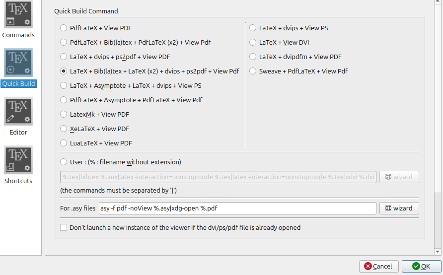

# Tour de table : Quels besoins 

# De quoi on parle : éditeur de texte vs traitement de texte 


Word : propriétaire (contrairement à Writer de LibreOffice)
Word et Writer sont des traitements de texte
Un traitement de texte réalise des opérations de manière opaque pour l'usager
il ne balise pas assez le texte (titre, sous-titre, notes, citation, références), il ne balise pas non plus assez les références
(@vitali-rosatiChercheursSHSSaventils2018)   

voir également présentation de Daphné Mathelier ( @mathelierIntroductionAuLangage2022 )

> Utiliser Markdown \[...\] permet de revenir à des méthodes qui vont à l’essentiel en
faisant les choses dans l’ordre – écrire, illustrer, éditer puis publier – de manière
durable et sans perte de temps et d’énergie inutiles

# Présentation du plugin betterbibtex pour Zotero 

Télécharger le plugin dans Zotero
exporter la collection en fichier .bib dans l'espace de travail de manière synchronisée 

# Zotero et Markdown 

Conversion du Markdown en HTML, epub, opendocument, openoffice : pandoc + citeproc  
Conversion du Markdown en pdf : pandoc + citeproc + \LaTeX\  (xelatex)  

## conversion de base en PDF 

Pandoc : convertisseur universel de fichiers développé par John MacFarlane en Haskell et distribué sous une licence GPL 
universel mais avec une limite importante : on ne peut pas convertir un pdf en document inscriptible.
Pas d'interface graphique, cet outil s'utilise en lignes de commande depuis un terminal ou bien peut être intégré à des applications (fichiers d'intégration continue, version pour Python : pypandoc, intégré à R, à Stylo, etc.)

markdown -> PDF  

1.  document source   
2.  format du document source (déduit ce format de l'extension .md, sinon `-f markdown`)  
3.  document destination  
4.  format du document de destination (déduit ce format de l'extension .pdf, sinon `-t pdf )  
5.  lien avec le fichier source des références bibliographiques (*.bib)  
6.  lien avec le fichier de présentation des références (*.csl < https://zotero/org/styles)  
7.  lien avec le package citeproc pour l'interprétation du fichier bib   
8.  lien avec le package xelatex (issu de TeXLive) pour la conversion en pdf   

```shell
pandoc zotero_markdown_latex.md \
    -f markdown \
    --bibliography=biblio/biblio.bib \
    --csl=csl/nature.csl \
    --citeproc \
    --pdf-engine=xelatex \
    -t pdf \
    -o zotero_markdown_latex.pdf
```

## conversion du markdown en $\LaTeX 

```shell
pandoc zotero_markdown_latex.md \
    -f markdown \
    --bibliography=biblio/biblio.bib \
    --csl=csl/nature.csl \
    --citeproc \
    --pdf-engine=xelatex \
    -o zotero_markdown_latex.tex
```

## conversion en html avec une css 

```shell
pandoc zotero_markdown_latex.md \
    -f markdown \
    --standalone \
    --bibliography=biblio/biblio.bib \
    --css=style.css \
    --csl=csl/nature.csl \
    --citeproc \
    --pdf-engine=xelatex \
    -t html \
    -o zotero_markdown_latex.html
```

## Références

:::{#refs}
:::

pour une conversion en html : 

```html
<div id="refs"><div>
```
<div id="refs"><div>


## Obsidian 

2 plugins : 

1. [Citation](https://github.com/hans/obsidian-citation-plugin) de Jon Gautier
2. [Pandoc Reference List](https://github.com/mgmeyers/obsidian-pandoc-reference-list) de Matthew Meyers

installer, activer dans Obsidian (community plugins) 

### Paramétrage de Citation : 

Citation Database format : bibtex  
Citation database path : lien absolu vers le fichier .bib  
Literature Notes Folder : nom_du_dossier  
Literature Note Template : \@{{citekey}}  
Literature Note Content Template :   

```yaml
title: "{{title}}"
author: {{authorString}}
year: {{year}}
publisher: {{publisher}}
publication: {{containerTitle}}
url: {{URL}}
note: {{note}}
doi: {{doi}}
tags: [ref]
```
### Paramétrage de Pandoc Reference List  

Fallback Path To pandoc : lien absolu vers Pandoc (Linux : ```$ whereis pandoc``` , pour Windows : ```C:\> where.exe pandoc.exe```)
Path to bibliography file : Lien absolu vers le fichier .bib (même lien que pour Citation)
Pull bibliography from Zotero : on  
zotero port : 23119  


## autre éditeur 

# VScode + Zotero + LaTeX 

## 

charger le plugin [LaTeX Workshop](https://marketplace.visualstudio.com/items?itemName=James-Yu.latex-workshop)
Dans les paramètres de VSCode (Ctrl+Maj+P) > Open User settings.json

copier le code suivant : 

```json 

/* set a workflow for LaTeX compilation */

    "latex-workshop.latex.recipes": [
      { 
        /* add compile recipe for biber using xelatex */
        "name": "xelatex -> biber -> xelatex*2",
        "tools": [
            "xelatex",
            "biber",
            "xelatex",
            "xelatex"
          ]
       },      
      ],
    
     "latex-workshop.latex.tools": [
        
      {
          "name": "pdflatex",
          "command": "pdflatex",
          "args": [
              "-synctex=1",
              "-interaction=nonstopmode",
              "-file-line-error",
              "%DOC%"
          ]
      },
      {
          "name": "bibtex",
          "command": "bibtex",
          "args": [
              "%DOCFILE%"
          ]
      },
      {
        /*add biber entry */
          "name": "biber",
          "command": "biber",
          "args": [
               "%DOCFILE%"
        ]
      },
      {
          "name": "xelatex",
          "command": "xelatex",
          "args": [
            "-synctex=1",
            "-interaction=nonstopmode",
            "-file-line-error",
            "%DOC%"
            ]
       }
```


## éditeur $\LaTeX  en ligne 

- Overleaf : éditeur $\LaTeX [en ligne](https://www.overleaf.com/)

Création de compte gratuite. Pas d'abonnement communautaire à l'Université de Rennes, pas de possibilité de synchroniser avec Zotero  
Le fichier bib qui est uploadé doit être complet ou bien uploadé plusieurs fois.   

- Stylo : accès via la création d'un compte Humanum  

Stylo a été créé par Marcelo Vitali-Rosati pour mettre en oeuvre ses principes d'écriture pour les SHS 
Disponible sur la plateforme Humanum. 
Intègre Pandoc et $\LaTeX  

## éditeur $\LaTeX en local 

TeXStudio ou TeXmaker  

Exemple avec TeXmaker  : comment configurer TexMaker pour utiliser biber afin de générer la bibliographie ?

Utiliser biber à la place de bib(La)Tex pour gérer les références  

(user > user commands > edit user commands)  

puis dans Options remplacer bibtex par biber :  

(options> Configure TeXmaker > commands) ; entrer dans le champ 'Bib(la)tex' = «/bin/biber» % (vérifier que biber est bien dans le dossier /bin )   

Configurer les commandes d'utilisateur pour remplacer la commande bibtex par biber   
(cela nécessite que le package biber soit appelé dans l'entête du document)  
puis dans le processus de compilation, choisir $\LaTeX + BibLaTex + $\LaTeX(x2) + dvips + ps2pdf + see pdf  

(options > configure texmaker > Quick build)  

  


